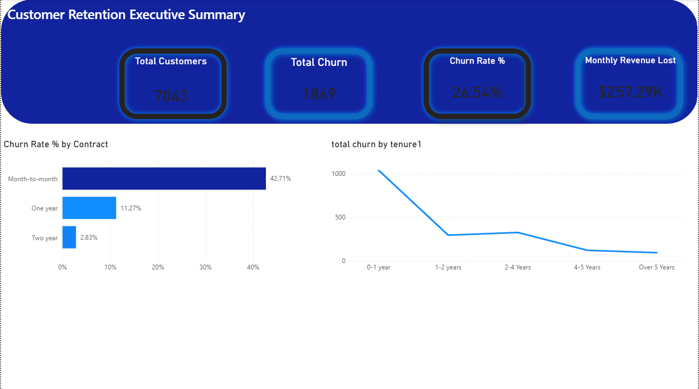

# 📊 Telecom Customer Churn Analysis
### Identifying a **$257K Monthly Revenue Leak** through Data-Driven Insights

## 📌 Project Overview
This project analyzes a dataset of **7,043 customers** from a Telecommunications company to identify the primary drivers of customer churn. By using **Power BI**, **Power Query**, and **DAX**, I transformed raw data into an interactive Executive Summary that highlights where the company is losing money and how to stop it.

---

## 🖼️ Dashboard Preview

---

## 🚀 Key Business Insights
* **The Main Culprit:** Customers on **Month-to-Month contracts** have a staggering **42.7% churn rate**, compared to just **2.8%** for those on two-year contracts.
* **The Revenue Impact:** The company is currently losing **$257.29K every month** in lost subscription fees from churned customers.
* **The "Danger Zone":** Churn is highest in the **first year (0-12 months)**. If a customer stays past year two, their loyalty increases significantly.

## 🛠️ Technical Skills Demonstrated

### 1. Data Transformation (Power Query)
* Cleaned and profiled the dataset to handle missing values and correct data types.
* Created **Tenure Cohorts** (0-1 Year, 1-2 Years, etc.) to segment the customer base into logical business groups.

### 2. Advanced DAX (Data Analysis Expressions)
I developed a dedicated measures table to calculate KPIs dynamically:
* **Total Churn:** `CALCULATE(COUNT(customerID), Churn = "Yes")`
* **Churn Rate %:** `DIVIDE([Total Churn], [Total Customers], 0)`
* **Monthly Revenue Lost:** Sum of monthly charges specifically for customers who have already churned.

### 3. Data Visualization & UI Design
* Designed a high-contrast **Executive Dashboard** using a custom dark-mode theme.
* Implemented **Conditional Formatting** to highlight high-risk segments.
* Developed a **Retention Curve** using Line Charts to visualize customer drop-off over time.

## 📂 Repository Contents
* **`Churn_Analysis.pbix`**: The full Power BI project file (includes Data Model & DAX).
* **`WA_Fn-UseC_-Telco-Customer-Churn.csv`**: The raw dataset used for the analysis.
* **`dashboard_preview.png`**: A high-resolution preview of the final report.

## 💡 Strategic Recommendation
Based on the data, the business should prioritize **incentivizing Month-to-Month customers** to move to **1-year or 2-year contracts** (e.g., via a "loyalty discount"). Reducing the month-to-month churn by even 10% would save the company over **$25,000 in monthly revenue.**

---
**Analysis by: Aman Shukla**
